#  Test API

Vous êtes sur la documentation qui vous explique comment pouvoir tester l'API.

L'API n'est pas facile à utiliser lorsqu'on ne connaît pas l'environnement, c'est pour cella que cette docs est là pour vous aider.

##  Comment se connecter à un utilisateur

Premièrement, après avoir lancé le docker (*[debug](README.md#installation)*) avec les containers, vous devrez accéder à cette URL: [http://localhost:5000/swagger/index.html](http://localhost:5000/swagger/index.html). C'est l'URL de Swagger de notre API, qui permet de documenté nos routes.

En étant avec le docker de debug il remplira automatiquement la base de données et créera un utilisateur de dev pour chaque rôle.

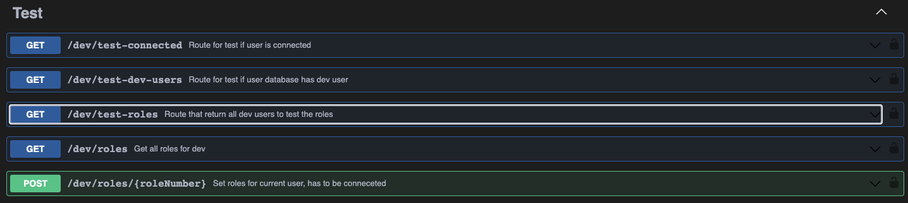

Dans l'image, au-dessus, vous pouvez voir la catégorie "Test" et que l'onglet qui nous intéresse est surligner.

Il faut cliquer dessus pour l'ouvrir.

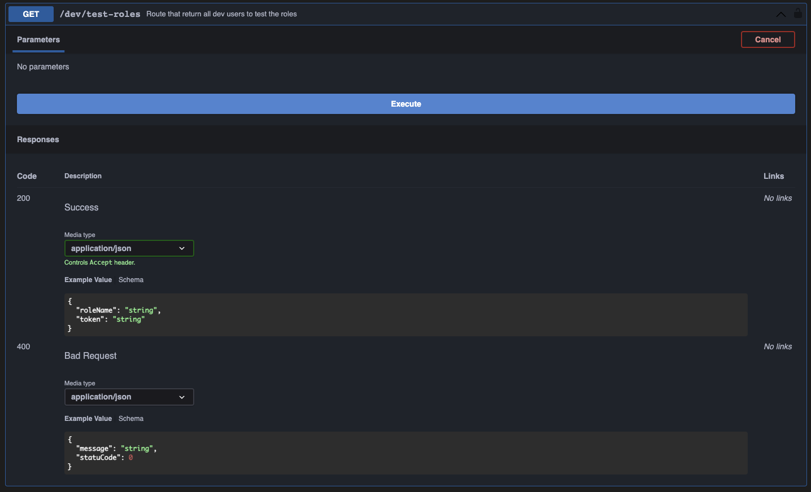)

Une fois ouvert, il vous faut faire "Execute".

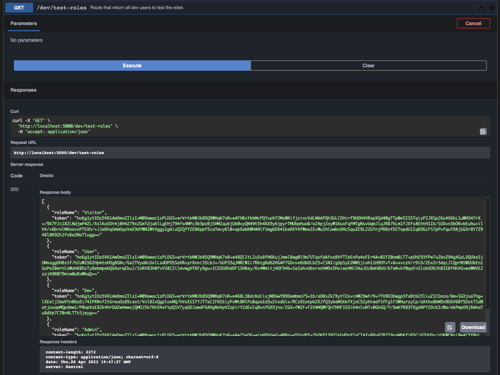)

Une fois exécute, on peut voir le nom du rôle avec un Token JWT.

Maintenant, il suffit de copier le token du rôle que l'on veut tester, et ensuite d'aller l'ajouter dans l'authorize.

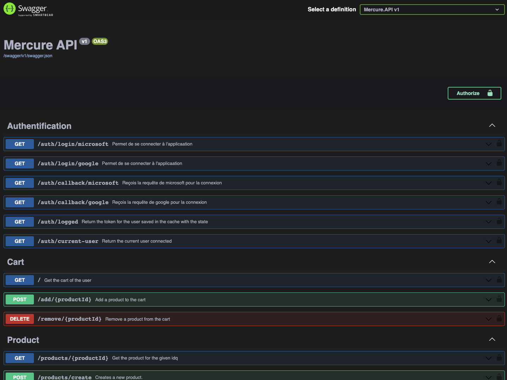

Une fois le menu de Authorize ouvrir, il faut écrire dedans : Bearer {token}, remplacer {token} par le token copier du rôle.

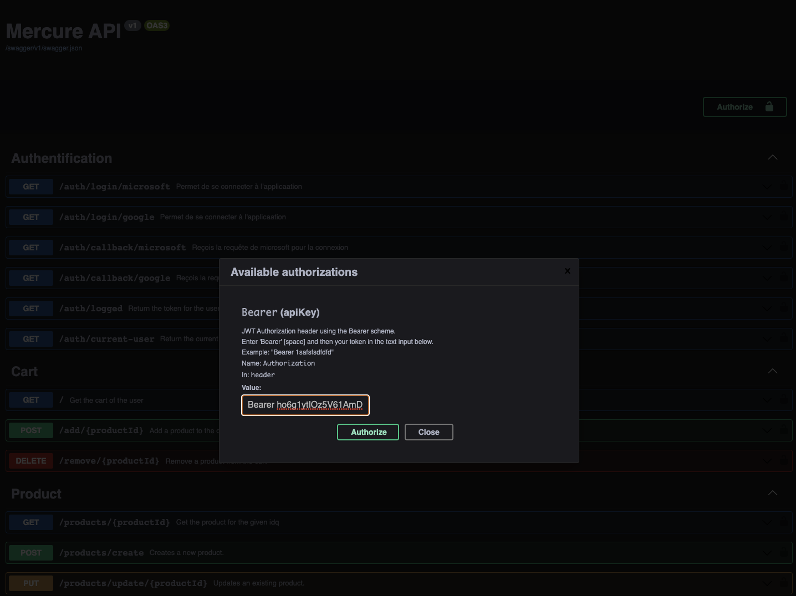

Une fois écris, il faut cliquer sur "Authorize" et vous avez appliqué le token de cet utilisateur.

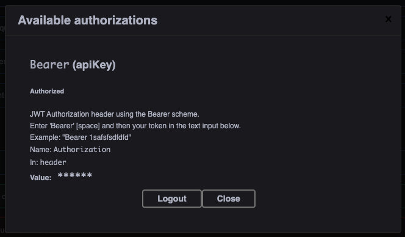

Maintenant vous pouvez tester les routes.

## Les routes pour changer de rôles

Il faut retourner dans la catégorie "Test" et regarder pour la routes "roles".

Faire "Try Out" et ensuite "Execute" et vous aurez tous les rôles de l'application.

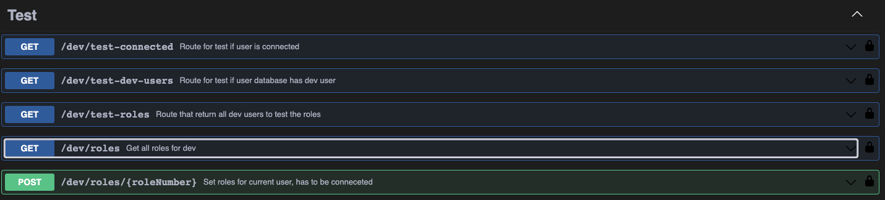

Voici les résultats de la routes.

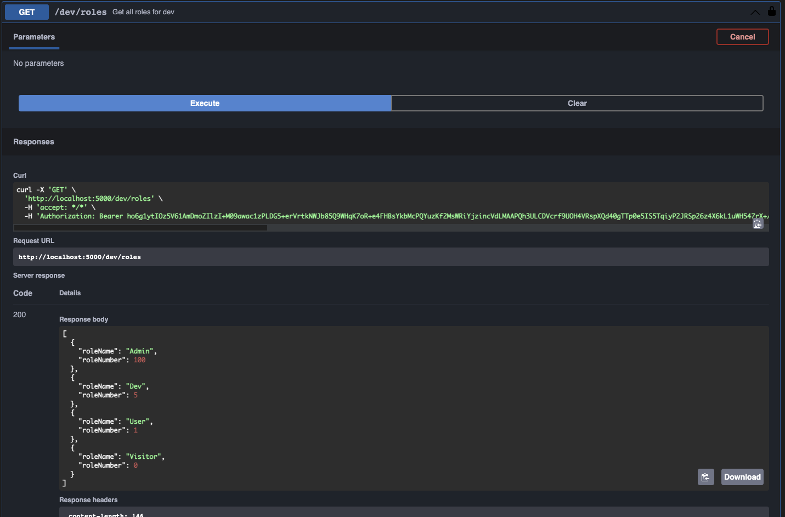

Il y a la route "roles" qui utilise la méthode "POST" et qui permet de se mettre un certain numéro de rôles (donc un rôle existant) à notre utilisateur.

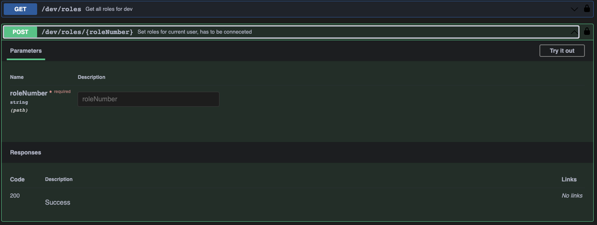

Il faut faire "Try Out"

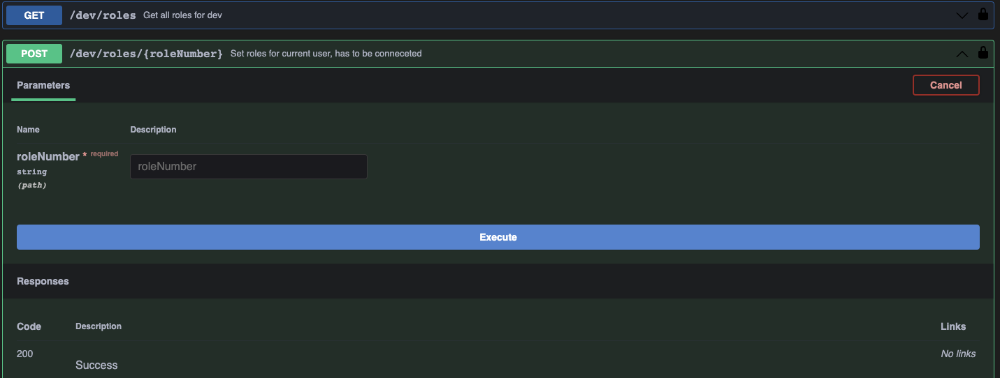

Il faut indiquer le roleNumber que vous avez pu voir dans la réponse de "roles" qui vous donnais le nom du rôle et son numéro.

Ensuite vous n'avez que à exécuter et voir le message de retour.

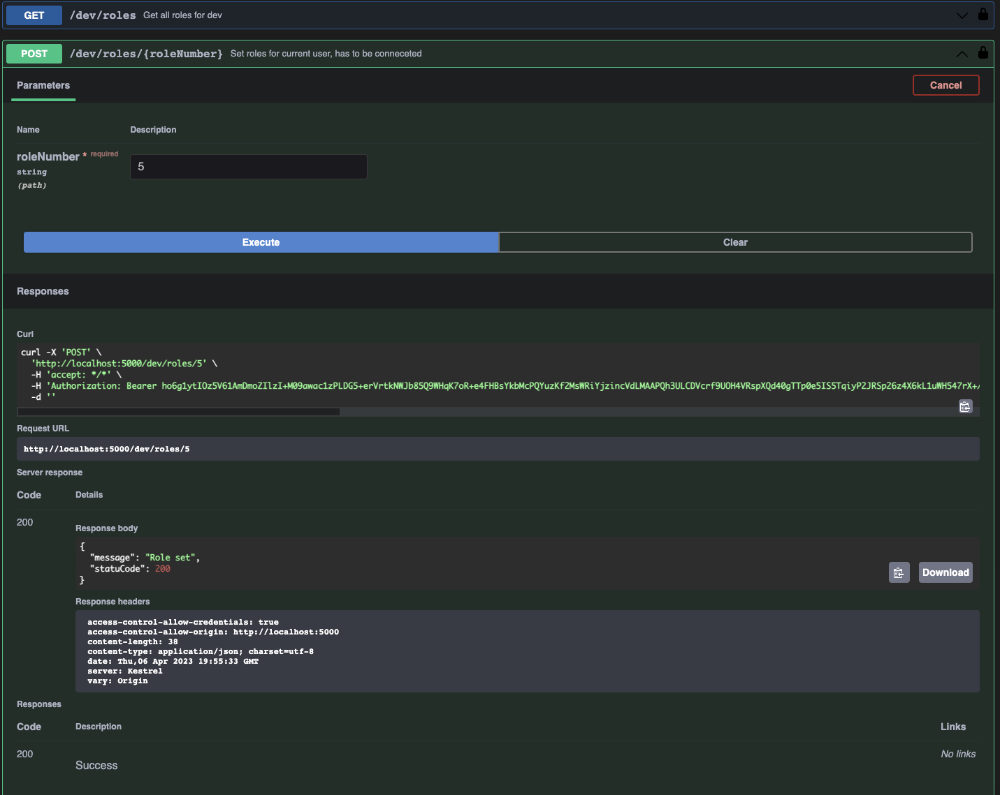

## OpenAPI/Swagger

Swagger, permet de lire les commentaires qui permettent à OpenAPI de les lires et de les afficher et tester.